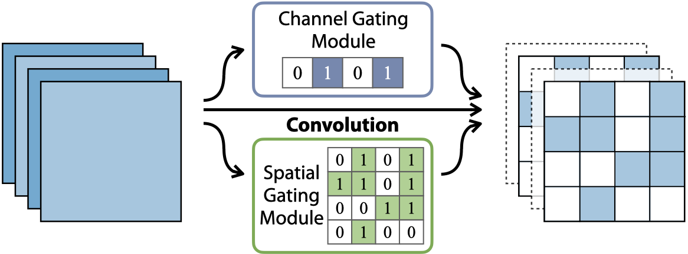

# Dynamic Dual Gating Neural Networks

This repository contains the PyTorch implementation for 

> **Dynamic Dual Gating Neural Networks**  
> Fanrong Li, Gang Li, Xiangyu He, Jian Cheng  
> ICCV 2021 Oral  



## Getting Started

### Requirements

The main requirements of this work are:

- Python 3.7  
- PyTorch == 1.5.0  
- Torchvision == 0.6.0  
- CUDA 10.2

We recommand using conda env to setup the experimental environments.


```shell script
# Create environment
conda create -n DGNet python=3.7
conda activate DGNet

# Install PyTorch & Torchvision
pip install torch==1.5.0 torchvision==0.6.0

# Clone repo
git clone https://github.com/anonymous-9800/DGNet.git ./DGNet
cd ./DGNet

# Install other requirements
pip install -r requirements.txt
```

### Trained models
Our trained models can be found here: [Google Drive](https://drive.google.com/file/d/1_-G5eHm3PUrrorjzp8w17W7ogZZoTElk/view?usp=sharing). And the pretrained cifar10 models can be found here: [Google Drive](https://drive.google.com/file/d/15sM2W2ADqtq5Gr8RTdaFalPK7qIw0VXF/view?usp=sharing). Unzip and place them into the DGNet folder.

### Evaluate a trained DGNet

```shell script
# CIFAR-10
sh ./scripts/cifar_e.sh [ARCH] [PATH-TO-DATASET] [GPU-IDs] [PATH-TO-SAVE] [PATH-TO-TRAINED-MODEL]

# ResNet on ImageNet
sh ./scripts/imagenet_e.sh [ARCH] [PATH-TO-DATASET] [GPU-IDs] [PATH-TO-SAVE] [PATH-TO-TRAINED-MODEL]

# Example
sh ./scripts/imagenet_e.sh resdg34 [PATH-TO-DATASET] 0 imagenet/resdg34-04-e ./trained_models_cls/imagenet_results/resdg34/sparse06/resdg34_04.pth.tar
```

### Train a DGNet
```shell script
# CIFAR-10
sh ./scripts/cifar_t.sh [ARCH] [PATH-TO-DATASET] [TARGET-DENSITY] [GPU-IDs] [PATH-TO-SAVE] [PATH-TO-PRETRAINED-MODEL]

# ResNet on ImageNet
sh ./scripts/imagenet_t.sh [ARCH] [PATH-TO-DATASET] [TARGET-DENSITY] [GPU-IDs] [PATH-TO-SAVE]

# Example
sh ./scripts/imagenet_t.sh resdg34 [PATH-TO-DATASET] 0.4 0,1 imagent/resdg34-04
```

## Main results

<table>
    <tr>
        <td><b>Model</td>
        <td><b>Method</td>
        <td><b>Top-1 (%)</td>
        <td><b>Top-5 (%)</td>
        <td><b>FLOPs</td>
        <td><b>Google Drive</td>
    </tr>
    <tr>
        <td rowspan="2">ResNet-18</td>
        <td>DGNet (50%)</td>
        <td>70.12</td>
        <td>89.22</td>
        <td>9.54E8</td>
        <td><a href="https://drive.google.com/file/d/1h-g-43p9_g6DvbIatx-gE-LNaMWEJYrw/view?usp=sharing">Link </td>
    </tr>
    <tr>
        <td>DGNet (60%)</td>
        <td>69.38</td>
        <td>88.94</td>
        <td>7.88E8</td>
        <td><a href="https://drive.google.com/file/d/1cdZmpdwoib0dkbpJoyIGg0XTq8JJbKfF/view?usp=sharing">Link</td>
    </tr>
    <tr>
        <td rowspan="2">ResNet-34</td>
        <td>DGNet (60%)</td>
        <td>73.01</td>
        <td>90.99</td>
        <td>1.50E9</td>
        <td><a href="https://drive.google.com/file/d/1_HWmTtlnyb1tw3EHgLft9pRdfx7354wJ/view?usp=sharing">Link</td>
    </tr>
    <tr>
        <td>DGNet (70%)</td>
        <td>71.95</td>
        <td>90.46</td>
        <td>1.21E9</td>
        <td><a href="https://drive.google.com/file/d/1JmvB6b5Av75aznNFz1vDRrtY3D5_2_X2/view?usp=sharing">Link</td>
    </tr>
    <tr>
        <td rowspan="2">ResNet-50</td>
        <td>DGNet (60%)</td>
        <td>76.41</td>
        <td>93.05</td>
        <td>1.65E9</td>
        <td><a href="https://drive.google.com/file/d/129XJ-Ktt9QO3afukNxrxEaPn-lr1QJmI/view?usp=sharing">Link</td>
    </tr>
    <tr>
        <td>DGNet (70%)</td>
        <td>75.12</td>
        <td>92.34</td>
        <td>1.31E9</td>
        <td><a href="https://drive.google.com/file/d/12CWsJJnRPmAA48cianuEI7ENIKOXN1RX/view?usp=sharing">Link</td>
    </tr>
    <tr>
        <td>MobileNet-V2</td>
        <td>DGNet (50%)</td>
        <td>71.62</td>
        <td>90.05</td>
        <td>1.60E8</td>
        <td><a href="https://drive.google.com/file/d/1uxcpoj4KyXnC-xtKRt6teD6tmrfJqxHx/view?usp=sharing">Link</td>
    </tr>
</table>

## Citation

If you find this project useful for your research, please use the following BibTeX entry.

    @inproceedings{dgnet,
      title={Dynamic Dual Gating Neural Networks},
      author={Li, Fanrong and Li, Gang and He, Xiangyu and Cheng, Jian},
      booktitle={Proceedings of the IEEE International Conference on Computer Vision (ICCV)},
      year={2021}
    }

## Contact
For any questions, feel free to contact: <lifanrong2017@ia.ac.cn>
